# **Calorie Analysis**

An Android app designed to help users track their calorie intake, calculate BMI, and achieve their health and fitness goals through a user-friendly interface and advanced features.

---

## **Table of Contents**

1. [Overview](#overview) 
2. [Demo Video](#demo-video) 
3. [Screenshots](#screenshots)  
4. [Features](#features)  
5. [Technologies Used](#technologies-used) 
6. [Installation](#installation)   
7. [Developers](#developers)   


---

## **Overview**

The **Calorie Analysis** app helps users maintain a healthy lifestyle by tracking calorie consumption, monitoring BMI, and setting weight goals. It offers personalized recommendations based on user input, supports Google Sign-In for secure data storage, and enables users to explore weight progress from others worldwide.

---

## **Demo Video**
[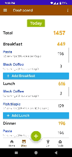](./screenshots/calorie_analysis_large.gif)  
*Click on the image to view it in a larger size.*

---

## **Screenshots**


| Home Screen | Floating Button | Food Categories and Search |
|-------------|-----------------|----------------------------|
| 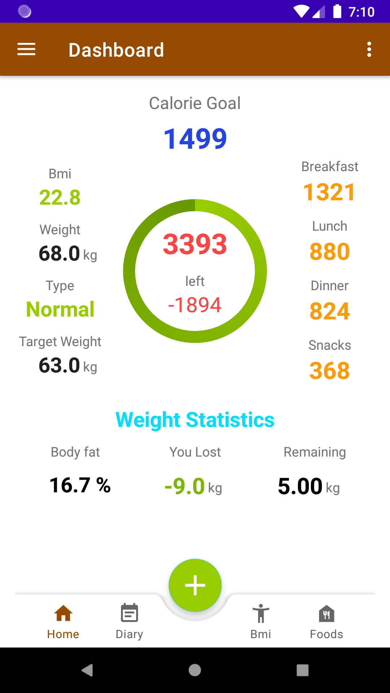 | 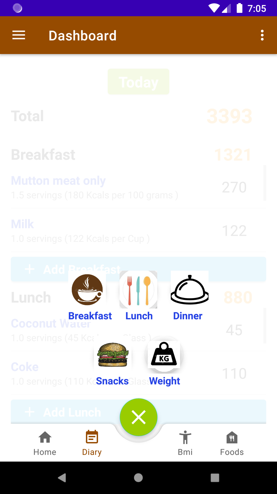 | 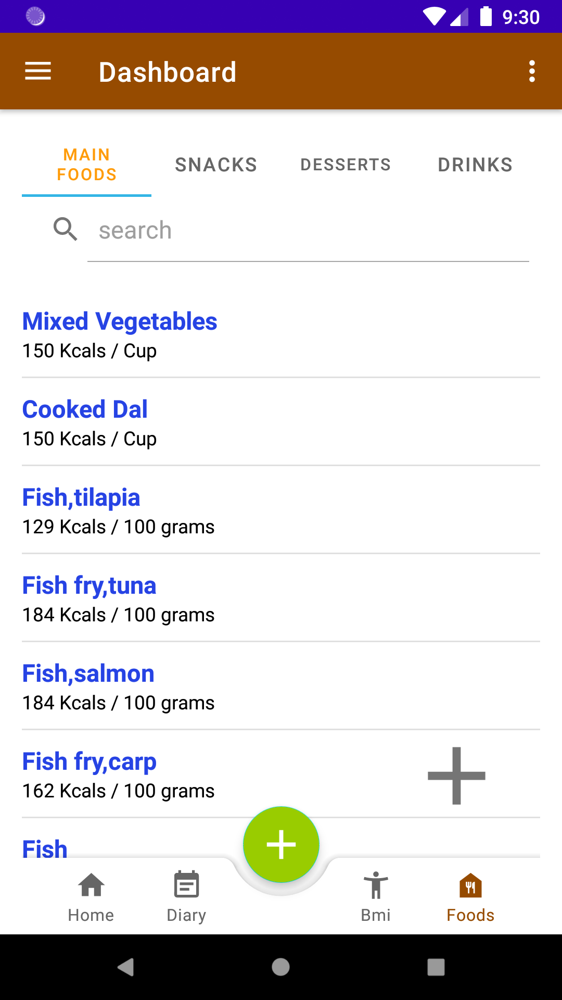 |
| Recommended Calorie Calculation | BMI Progress | Google Sign In |
| 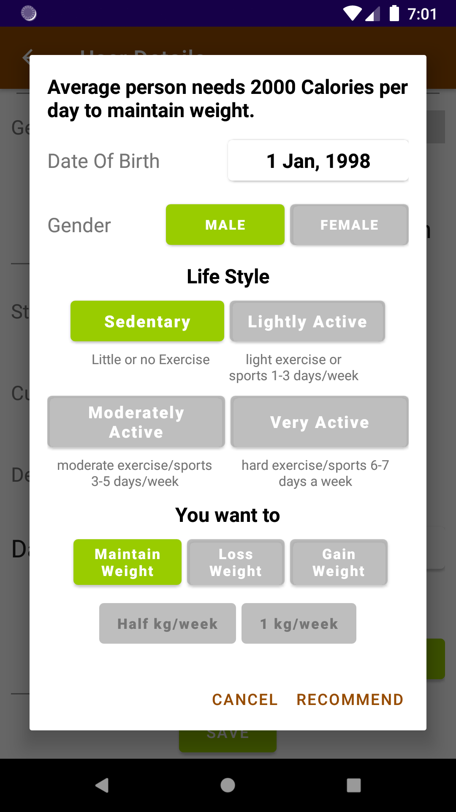 | 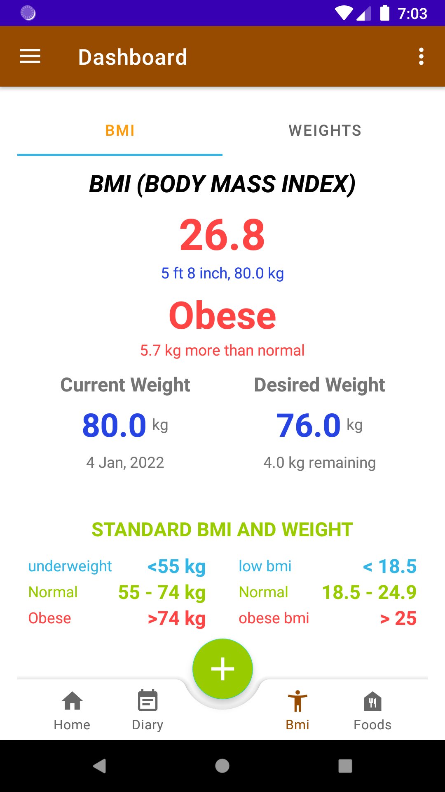 | 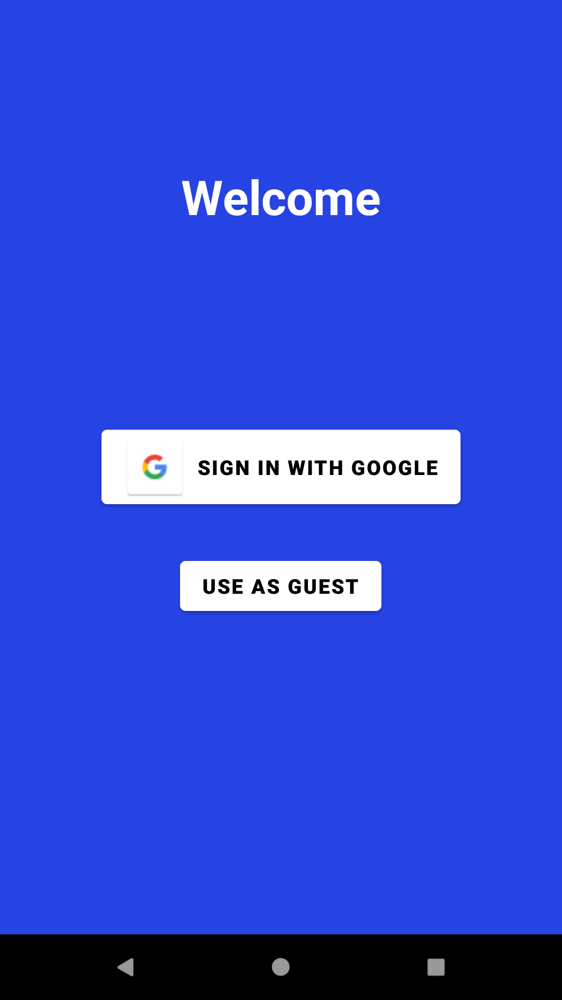 |
| User Progress History | Navigation Drawer | Global Community |
| 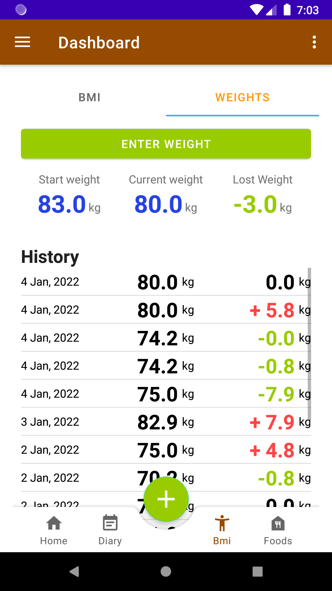 | 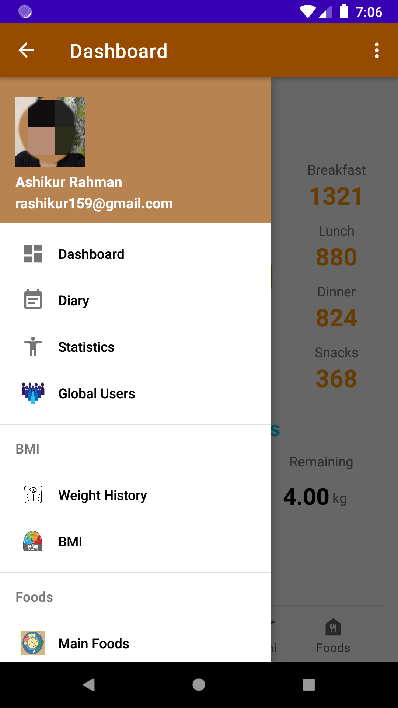 | 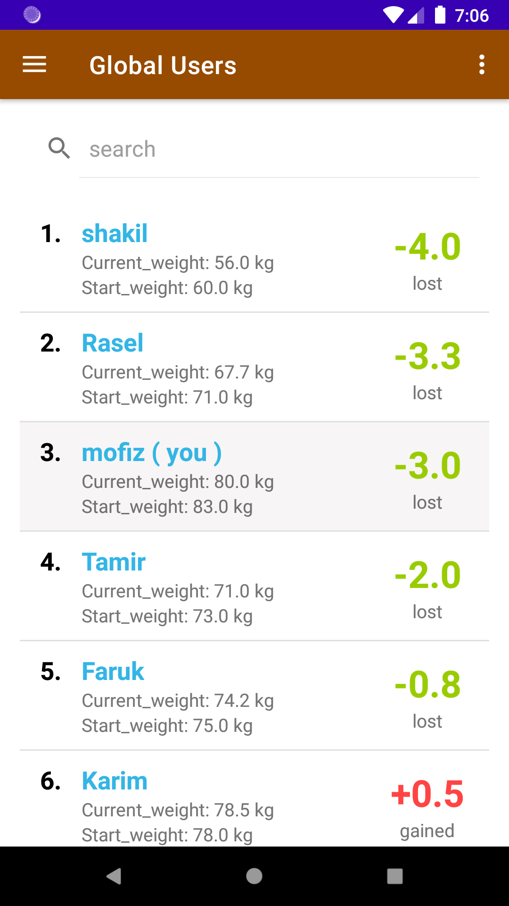 |
| Daily Food Intakes | Adding Consumed Food to Diary |
| 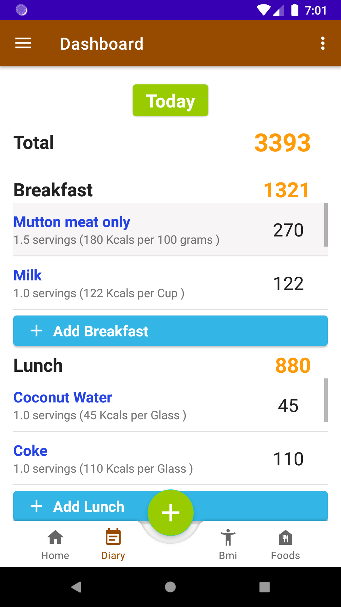 | 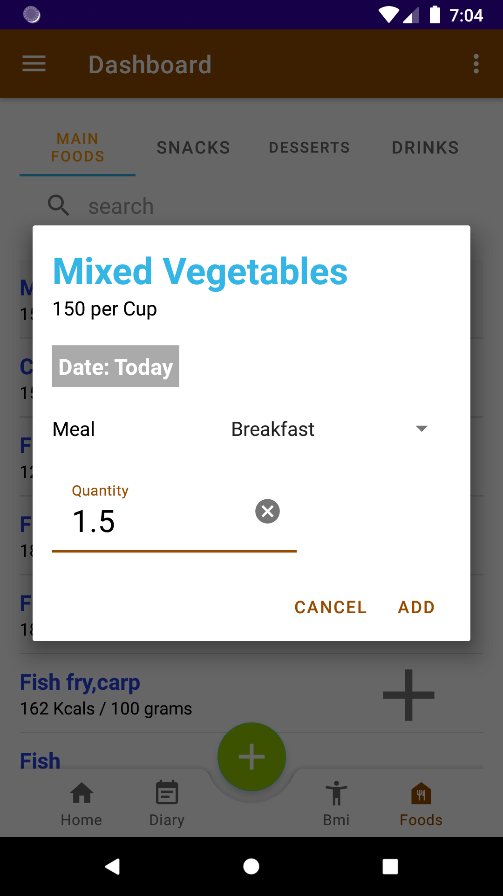 |


---


## **Features**

### **Implemented Functionalities**
- **Calorie Tracking:**  
  - Calculate daily consumed calories and view detailed history.  
  - Add, update, or delete food entries with user-defined portion sizes.  
  - Categorize food into Main Foods, Snacks, Desserts, and Drinks.  
  - Search food items with ease.  

- **BMI & Health Metrics:**  
  - Calculate BMI and body fat percentage.  
  - Get recommendations for weight goals (maintain/loss/gain).  
  - Understand weight ranges for your height.  

- **User Progress:**  
  - Monitor weight history and progress toward goals.  
  - View other users’ weight progress globally, ranked by weight lost.  

- **User Authentication:**  
  - Secure progress with Google Sign-In.  
  - Explore app features in guest mode.  

### **User Experience Features**
- Bottom Navigation, Floating Action Buttons, and Navigation Drawers for intuitive navigation.  
- Optimized ListViews with BaseAdapter for smooth scrolling.  
- Multi-fragment layouts with swipe and tab navigation.  

---


## **Technologies Used**

- **Programming & Design:**  
  - Java (Backend)  
  - XML (UI Design)  

- **Database & Storage:**  
  - Firebase (User Data)  
  - Shared Preferences (Local Storage)  

- **Libraries & Tools:**  
  - Android Studio (IDE)  
  - Picasso (Image Loading Library)  

- **Android Features:**  
  - Fragments, FragmentPagerAdapter, ViewPager  
  - Navigation Drawer, Bottom NavigationView, Floating Action Button  
  - ListView, SearchView, Menu  
  - Layouts: LinearLayout, RelativeLayout, CoordinatorLayout  

---


## **Installation**

Follow the steps below to get the project up and running on your local machine:

1. Clone the repository:
   ```bash
   git clone https://github.com/AshikurRahman3/Calorie-Analysis-.git

2. Open the project in Android Studio:

    - Launch Android Studio.
    - Select **Open an existing project**.
    - Navigate to the cloned project directory and open it.
3. Sync the project with Gradle:

    - After opening the project, Android Studio will prompt you to sync with Gradle.
    - Click **Sync Now** to ensure all dependencies are properly downloaded.
4. Run the project:

    - Connect an Android device or start an emulator.
    - Click on the **Run** button (green triangle) in Android Studio.
    - Select your device and wait for the app to launch.


## **Developers**

- Group no: **26**
- Group name: **Warriors**


- **Group Member 1:**

  - Name: **Ashikur Rahman**
  - Registration no: **2017331100**
  - Mobile no: **01726282979**
  - Email: **ashikur00@student.sust.edu**
- **Group Member 2:**
  - Name: **MD.SHAKIL**
  - Registration no: **2017331090**
  - Mobile no: **01755763136**
  - Email: **shakil90@student.sust.edu**

<small>&copy; 2021 - Dept. of CSE, SUST, BD</small>
