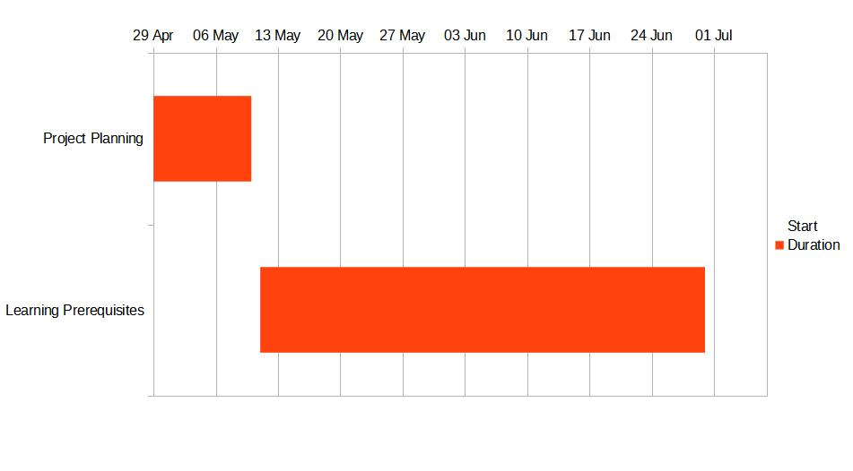

# G26-Calorie-Analysis

<!-- **Expected Timeline**

**Report on Learning  Pre-requisisties**
----------------------------------------

SL | Learning Task | Description | Status | Comment |
--:|:--------------|:------------|:------:|:--------|
1| basic layout,views,input output | designing what user can see and handling input output
2| Activity, fragments | more details about designing and behaviour of the app
3| Data base(sqliter or firebase-not sure | about store data in users device
4| json,api | getting data from Internet  -->

**Feature Descriptions:**

	1. Many food items with their calorie value
	2. Calculating BMI
	3. Calculating Daily calorie intake
	4. user defined food amount or portion size
	5. get health tips from internet

<!-- **Milestone Submissions:**

	Milestone 1:
	containing food items calorie value, bmi calculation and designing the apps initial layout
	
	Milestone 2:
	User defined food portions
	
	Milestone 3:
	Get health tips from internet -->

# Implemented Features

- **Calculate** daily consumed calories, user can also see his previous any other days consumed foods here
- **Google Sign in** to save users progress, user will not lose his data if he sign in
- Calculate recommended **daily calorie goal** by analysing gender, weight,lifestyle and purpose like weight maintain/loss/gain of the user
- know users **BMI** and what is standard bmi
- Know how much weight is ***normal/overweight/underweight** for users height
- Know user **body fat percentage** which is based on users gender,height,age, weight
- Watch **weight history** and know is user progressing or not to users weight loss/gain goal
- Add users preferred **custom food** by setting their name , calories per servings. 
- Four differnet catagoires for food-- **Main foods,Snacks,Desserts,Drinks**
- **Search** food items if the food list long. user dont need to scroll everything
- **Delete** or **update** weight, food or consumed food , if you thing user has entered them by mistake.
- Watch other **users from around the world** about their progress, users list is sorted according to their weight lost value
- User can also use the app as **guest** if user want to check the features without signing in

<!-- # Not Implemented Features

- Food macros like how much carbs,protein, fat in each food item
- Grabing Exercise data from other fitness apps like **Google fit** to match daily calorie goal -->

# Used Technologies and Functionalities

- **Android Studio** as  **IDE** for developing android app
- **Java** as a Backend coding language
- **XML** to design user interface
- **Firebase** as database to contain users related data
- **Shared Preference** as simple storing functionality to store little data like storing users **user id** etc
- **Picasso** libraray dependency to get **Google acccount** user image
- **Android** functionalitites:
  - **Fragments**, to contain user information or data in sub screen
  - **FragmentContainerView**, to contain fragments
  - **FragmentPagerAdapter**, to give  multiple fragments access functionalities through **ViewPager** in single **Activity** or any other **Fragment** as **Child Fragment**.
  - **Floating Action Button** , to give much smooth experience to user when clicking some main functionality from homescreen 
  - **Navigation Drawer**, to show different options to user by swiping from left to right in the home screen
  - **Bottom NavigationView** , to provide click functionalities to move to other **Fragments** as well as to contain **Floating Action Button** which user can click to add weight or meal
  - **LinearLayout, RelativeLayout, CoOrdinator Layout**, to hold other views
  - **Button, Textview, ImageView** , to show texts , buttons, images
  - **Listview**, to show list items provieded by **ArrayList**
  -  **ViewPager, Tablayout** , to give swipe functionalities for moving from one **Fragment** to another and showing **Tabs**
  -  **BaseAdapter**, to smoothly handle list items to show, it uses small number of views to show any number of items in the list. Its optimization gives much free memory to user.
  - **OnClickeListener interface** to listen to click events of views
  - **SearchView**, to provide **search** functionality in **Listview** , search results are based on users **typed** characters in the **search box**
  - **Menu**, to provide some functionality in the **Action Bar**

# Contribution

- **Ashikur Rahman** ( Group member 1 )
  - **All Backend Coding in java**
  - **Initial setup when developing started**
  - **Most of the user Inteface designing through XML**
  - **Pusing and Commiting android project to github**

- **Md.Shakil** ( Group member 2 )
  - **Some user interface design through XML**
  - **Resource gatthering like tutorials for learning, images, library needed to run**
  - **details of food items**
  - **Formula needed to calculate some features like daily calorie goal , bmi, body fat percentage**

# Acknowledgement 

We are giving **Thanks** to the following **Contributors** for helping us **Indirectly:**

- [Udacity](https://www.udacity.com) , their [Android basics](https://www.udacity.com/course/android-basics-user-interface--ud834) course helps to learn many required thing for android development
- [Anisul Islam](https://www.youtube.com/c/anisulislamrubel), His youtube video playlist [Android development](https://www.youtube.com/c/anisulislamrubel/playlists?view=50&sort=dd&shelf_id=4), helped us very much to learn android development in **Bangla**
- [Stack Overflow](https://stackoverflow.com) community for their help to learn how to fix problems and bugs in app
- [GeeksForGeeks](https://www.geeksforgeeks.org), this websites some articles helped us how to implement certain feature in android app
- [Google](https://www.google.com), This organizations **Search Engine** helped us a lot to find our necessary resources.

# Developers

- Group no: **26**
- Group name: **Warriors**

- **Group Member 1:**

  - Name: **Ashikur Rahman**
  - Registration no: **2017331100**
  - Mobile no: **01726282979**
  - Email: **ashikur00@student.sust.edu**
- **Group Member 2:**
  - Name: **MD.SHAKIL**
  - Registration no: **2017331090**
  - Mobile no: **01755763136**
  - Email: **shakil90@student.sust.edu**

<small>&copy; 2021 - Dept. of CSE, SUST, BD</small>
